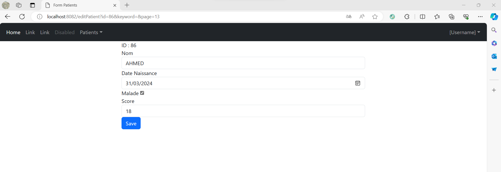
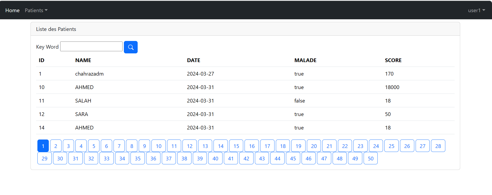
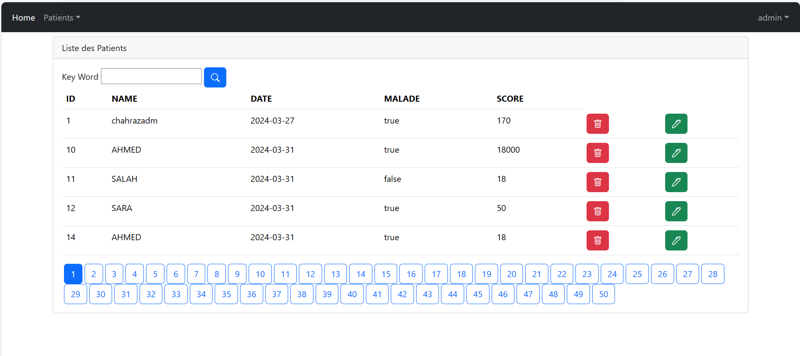
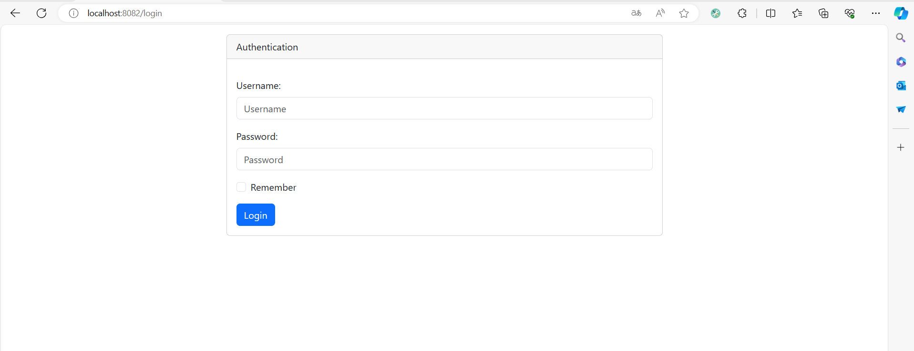
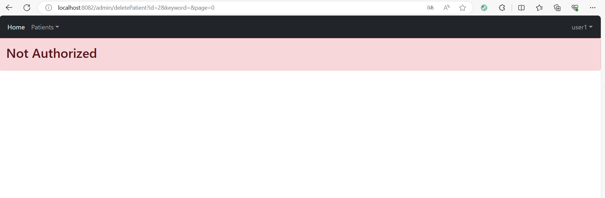

<h3> 1-Affichage des patients</h3>

<h3> 2-Pagination</h3>

<h3> 3-La recherche</h3>

<h3> 4-La suppression</h3>

<h3> Approche Rendu coté client</h3>

<h3> VERSION AMELIORE</h3>

<h3>Ajouter un patient</h3>

<h3>Modifier un patient</h3>

<h3>Cacher la suppression et la modification pour les users qui n'ont pas le role admin</h3>

<h3>Donner le privilège aux admins de modifier ou bien supprimer les patients</h3>

<h3>Ajout d'un formulaire d'authentification personnalisé avec InMemoryUser</h3>

<h3>Escalation lorsque le user qui n'a pas le role ADMIN on affiche notAuthorized</h3>

