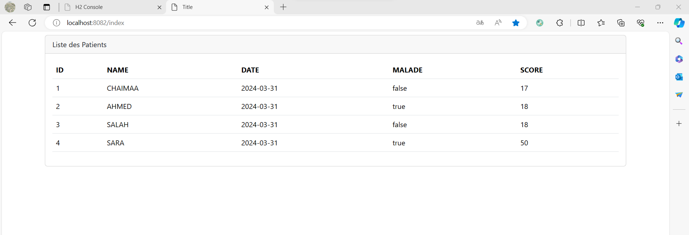
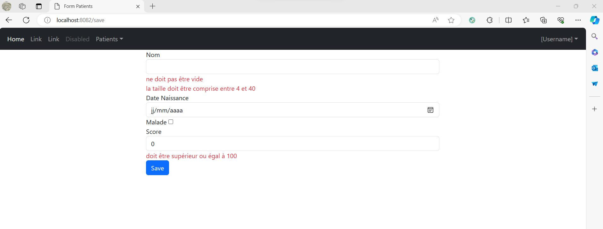
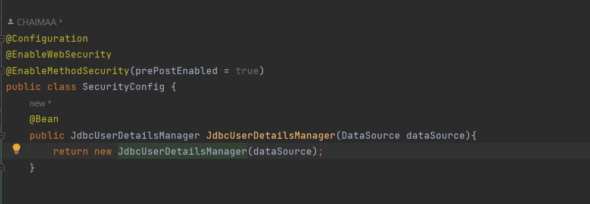
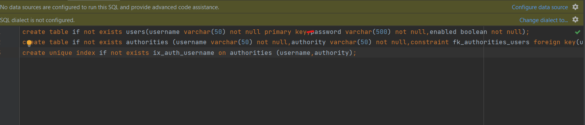
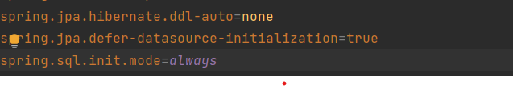
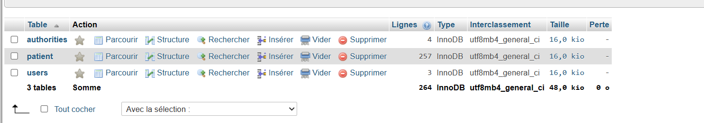
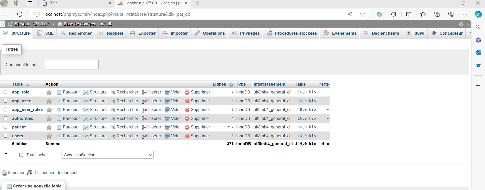
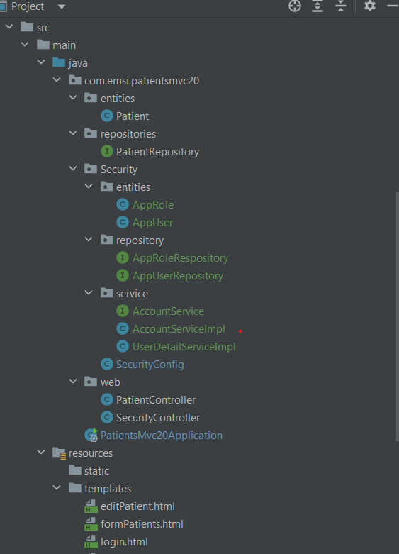

<h3> 1-Affichage des patients</h3>

<h3> 2-Pagination</h3>

<h3> 3-La recherche</h3>

<h3> 4-La suppression</h3>

<h3> Approche Rendu coté client</h3>

<h3> VERSION AMELIORE</h3>

<h3>Ajouter un patient</h3>

<h3>Modifier un patient</h3>

<h3>Cacher la suppression et la modification pour les users qui n'ont pas le role admin</h3>

<h3>Donner le privilège aux admins de modifier ou bien supprimer les patients</h3>

<h3>Ajout d'un formulaire d'authentification personnalisé avec InMemoryUser</h3>

<h3>Escalation lorsque le user qui n'a pas le role ADMIN essaye de faire des modification en utilisant le endPoint de l'admin on affiche notAuthorized</h3>

<h3>Spring security avec JDBCUserDetailsManager</h3>

<h3>Creation des TAble Users et Authorities</h3>

<h3>Parametrage du fichier application.properties</h3>

<h3>les tables sont creer sur mysql</h3>

<h3>Spring Security avec UserDetailsService</h3></h3>

<h3>Creation de nouvelle entities pour personnaliser Les roles et les users</h3>

<h3>Donner le role admin a user1</h3>

